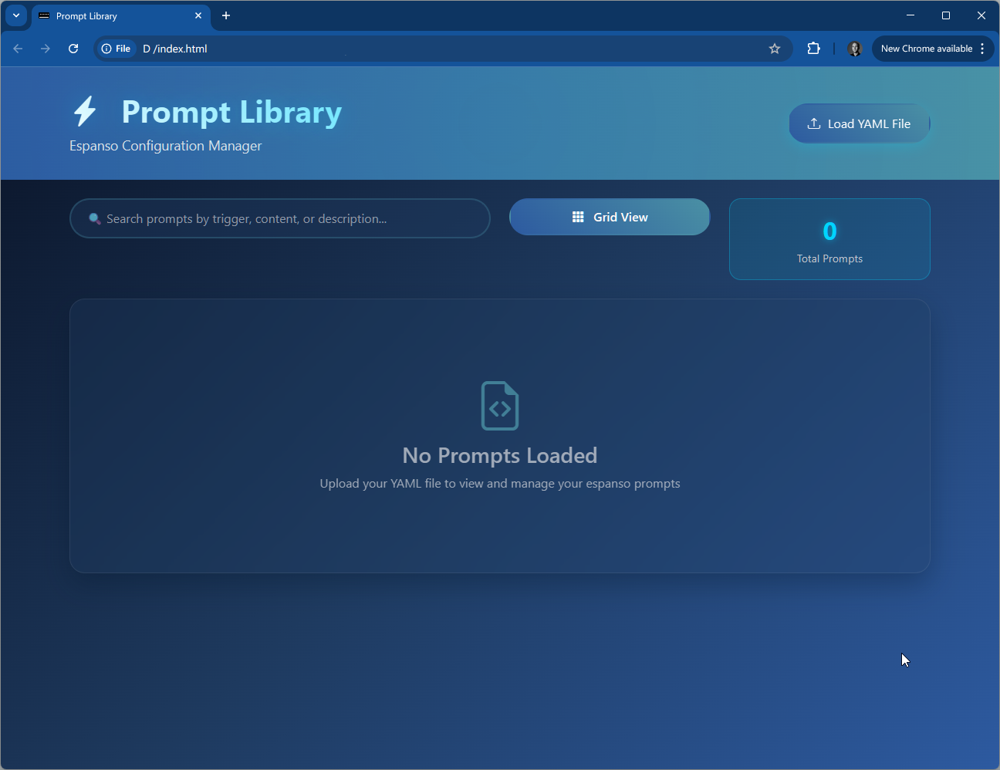

# Prompt Library

A minimal web-based manager for Espanso configuration files.  
View, search, and manage your Espanso YAML prompt files efficiently.

## Features

- Search prompts by trigger, content, or description
- Load Espanso YAML files directly in the browser
- Grid and list views for prompt management
- Displays total prompt count
- 100% client-side; no data leaves your machine

## Usage

1. Clone or download this repository.
2. Open `index.html` in your browser.
3. Click "Load YAML File" to import and manage your prompts.

## File Support

- Compatible with `base.yml`, `default.yml`, and custom Espanso YAML files.

## Credits

Developed independently, with inspiration from the Espanso community.  
Discovered [`espanso-gui`](https://github.com/unobserved-io/espanso-gui) by Ricky Kresslein after building this version.

## License

MIT License. Free to use and modify. 🛠
